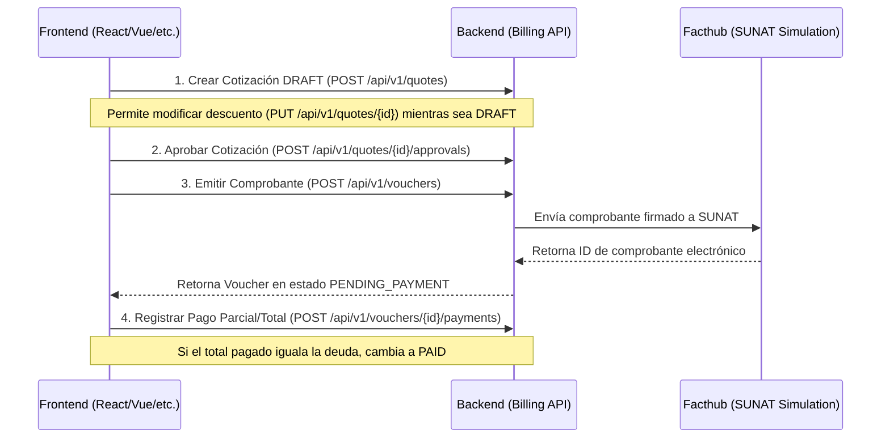
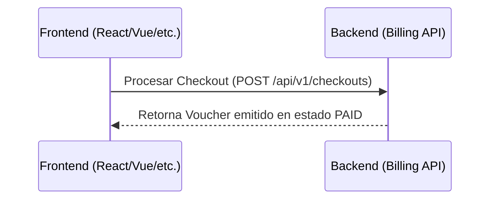

# Guía de Integración Frontend: Bounded Context de Facturación (Billing)

Esta guía detalla el uso de los endpoints del contexto delimitado de **Billing** (Facturación), diseñado para que el frontend interactúe de forma correcta y maneje los flujos de cotizaciones, emisión de comprobantes electrónicos (SUNAT/Facthub) y procesamiento de pagos.

---

## 🌐 Arquitectura de Flujo e Integración

El módulo de facturación gestiona el ciclo de cobro de los servicios mecánicos. Existen dos flujos de trabajo principales que el frontend puede implementar:

### Escenario A: Flujo Tradicional Paso a Paso
Ideal para talleres que cotizan, esperan aprobación del cliente, realizan el trabajo y posteriormente cobran (permitiendo pagos parciales).



### Escenario B: Proceso de Checkout Rápido
Ideal para cobro directo inmediato de un servicio. Genera el comprobante y aplica el pago total en una única transacción atómica.



---

## 🌍 Cabeceras Globales: Internacionalización (i18n)

Todos los endpoints del contexto de facturación soportan traducción dinámica de mensajes de error de negocio. El frontend debe enviar la cabecera `Accept-Language` en cada petición:

*   `Accept-Language: es` -> Errores y mensajes devueltos en **Español** (Por defecto).
*   `Accept-Language: en` -> Errores y mensajes devueltos en **Inglés**.

*Ejemplo de respuesta de error:*
```json
{
  "code": "QUOTE_CONFLICT",
  "message": "La cotización debe estar APROBADA para poder generar un comprobante.",
  "details": null
}
```

---

## 📑 Catálogo de Endpoints

### 1. Cotizaciones (Quotes)
Base URL: `/api/v1/quotes`

#### 1.1. Crear Cotización
Genera un presupuesto en estado `DRAFT` para una orden de trabajo (`WorkOrder`).

*   **Método:** `POST`
*   **URL:** `/api/v1/quotes`
*   **Payload (JSON):**
    *   `workOrderId` (UUID, Requerido): ID de la orden de trabajo origen.
    *   `branchId` (UUID, Requerido): ID de la sucursal del taller.
    *   `discountPercentage` (Double, Requerido): Porcentaje de descuento inicial (de `0.0` a `100.0`).
    
    *Ejemplo:*
    ```json
    {
      "workOrderId": "7b8db3c7-432d-4d7a-8b1d-c8ef6340455a",
      "branchId": "ea1f599a-3f41-477f-8c9a-b472ea64e5aa",
      "discountPercentage": 10.0
    }
    ```

*   **Respuesta Exitosa (`201 Created`):**
    *   `id` (UUID): ID autogenerado de la cotización.
    *   `workOrderId` (UUID): ID de la orden asociada.
    *   `branchId` (UUID): ID de la sucursal.
    *   `subtotalAmount` (BigDecimal): Monto bruto calculado antes del descuento.
    *   `discountPercentage` (Double): Descuento aplicado.
    *   `totalAmount` (BigDecimal): Monto neto final (`subtotal - descuento`).
    *   `status` (String): Estado de la cotización (`DRAFT`).
    
    *Ejemplo:*
    ```json
    {
      "id": "a90dfb2f-76c1-4b11-a88a-98adfe41566b",
      "workOrderId": "7b8db3c7-432d-4d7a-8b1d-c8ef6340455a",
      "branchId": "ea1f599a-3f41-477f-8c9a-b472ea64e5aa",
      "subtotalAmount": 150.00,
      "discountPercentage": 10.0,
      "totalAmount": 135.00,
      "status": "DRAFT"
    }
    ```

*   **Respuestas de Error comunes:**
    *   `400 Bad Request` (`validation_error`): Descuento fuera de rango [0-100] o campos requeridos ausentes.
    *   `404 Not Found` (`quote`): La orden de trabajo indicada no existe.
    *   `409 Conflict` (`quote`): Ya existe una cotización creada para esa orden de trabajo.

---

#### 1.2. Actualizar Descuento de Cotización
Modifica el porcentaje de descuento asignado a la cotización. **Solo se permite si la cotización está en estado `DRAFT`.**

*   **Método:** `PUT`
*   **URL:** `/api/v1/quotes/{id}`
*   **Path Variable:** `id` (UUID): ID de la cotización.
*   **Payload (JSON):**
    *   `discountPercentage` (Double, Requerido): Nuevo porcentaje (de `0.0` a `100.0`).
    
    *Ejemplo:*
    ```json
    {
      "discountPercentage": 15.5
    }
    ```

*   **Respuesta Exitosa (`200 OK`):**
    Retorna la cotización actualizada con los nuevos totales calculados.
    
    *Ejemplo:*
    ```json
    {
      "id": "a90dfb2f-76c1-4b11-a88a-98adfe41566b",
      "workOrderId": "7b8db3c7-432d-4d7a-8b1d-c8ef6340455a",
      "branchId": "ea1f599a-3f41-477f-8c9a-b472ea64e5aa",
      "subtotalAmount": 150.00,
      "discountPercentage": 15.5,
      "totalAmount": 126.75,
      "status": "DRAFT"
    }
    ```

*   **Respuestas de Error:**
    *   `404 Not Found`: Cotización no encontrada.
    *   `409 Conflict`: La cotización ya está aprobada o cancelada y no permite modificaciones de precio.

---

#### 1.3. Aprobar Cotización
Bloquea los precios calculados y transiciona el estado de la cotización de `DRAFT` a `APPROVED`, habilitándola para facturar.

*   **Método:** `POST`
*   **URL:** `/api/v1/quotes/{id}/approvals`
*   **Path Variable:** `id` (UUID): ID de la cotización.
*   **Payload:** Ninguno.
*   **Respuesta Exitosa (`200 OK`):**
    Retorna la cotización con el atributo `status` actualizado a `APPROVED`.

---

#### 1.4. Cancelar Cotización
Descarta la cotización del flujo comercial.

*   **Método:** `POST`
*   **URL:** `/api/v1/quotes/{id}/cancellations`
*   **Path Variable:** `id` (UUID): ID de la cotización.
*   **Payload:** Ninguno.
*   **Respuesta Exitosa (`200 OK`):**
    Retorna la cotización con el atributo `status` en `CANCELED`.

---

#### 1.5. Obtener Cotización por ID
Permite recuperar el estado y los totales actuales de una cotización específica.

*   **Método:** `GET`
*   **URL:** `/api/v1/quotes/{id}`
*   **Path Variable:** `id` (UUID): ID de la cotización.
*   **Respuesta Exitosa (`200 OK`):** Retorna el recurso de cotización.
*   **Respuesta de Error:** `404 Not Found` si el ID no corresponde a ningún registro.

---

#### 1.6. Buscar Cotizaciones por Sucursal
Lista todas las cotizaciones emitidas en una sede física para poblar tableros del negocio.

*   **Método:** `GET`
*   **URL:** `/api/v1/quotes?branchId={branchId}`
*   **Query Parameter:** `branchId` (UUID, Requerido): ID de la sucursal.
*   **Respuesta Exitosa (`200 OK`):**
    Arreglo JSON de cotizaciones.
    
    *Ejemplo:*
    ```json
    [
      {
        "id": "a90dfb2f-76c1-4b11-a88a-98adfe41566b",
        "workOrderId": "7b8db3c7-432d-4d7a-8b1d-c8ef6340455a",
        "branchId": "ea1f599a-3f41-477f-8c9a-b472ea64e5aa",
        "subtotalAmount": 150.00,
        "discountPercentage": 10.0,
        "totalAmount": 135.00,
        "status": "APPROVED"
      }
    ]
    ```

---

### 2. Comprobantes de Pago (Vouchers)
Base URL: `/api/v1/vouchers`

Un Voucher representa la obligación tributaria/fiscal legal (Factura o Boleta) enviada a SUNAT.

#### 2.1. Generar Comprobante
Genera una boleta o factura a partir de una cotización previamente aprobada. Realiza la simulación de firma y envío de comprobante mediante Facthub.

*   **Método:** `POST`
*   **URL:** `/api/v1/vouchers`
*   **Payload (JSON):**
    *   `quoteId` (UUID, Requerido): ID de la cotización en estado `APPROVED`.
    *   `type` (String, Requerido): Tipo de comprobante. Valores soportados: `"INVOICE"` (Factura), `"RECEIPT"` (Boleta).
    *   `customerDocumentType` (String, Requerido): Tipo de documento de identidad del cliente (ej. `"RUC"`, `"DNI"`).
    *   `customerDocumentNumber` (String, Requerido): Número del documento (11 dígitos para RUC, 8 para DNI).
    *   `customerName` (String, Requerido): Razón social o nombres y apellidos del cliente.
    
    *Ejemplo:*
    ```json
    {
      "quoteId": "a90dfb2f-76c1-4b11-a88a-98adfe41566b",
      "type": "INVOICE",
      "customerDocumentType": "RUC",
      "customerDocumentNumber": "20100078941",
      "customerName": "TALLERES UNIDOS S.A.C."
    }
    ```

*   **Respuesta Exitosa (`201 Created`):**
    *   `id` (UUID): ID del Voucher generado.
    *   `quoteId` (UUID): Cotización origen.
    *   `type` (String): `"INVOICE"` o `"RECEIPT"`.
    *   `customerDocumentType` (String): Tipo de documento.
    *   `customerDocumentNumber` (String): Número de documento.
    *   `customerName` (String): Nombre fiscal del cliente.
    *   `totalAmount` (BigDecimal): Monto total neto de cobro del comprobante.
    *   `status` (String): Estado de pago inicial (`PENDING`, `PARTIALLY_PAID`).
    *   `externalInvoiceId` (UUID): ID retornado por la pasarela de Facthub (SUNAT).
    *   `payments` (Array): Lista de pagos aplicados (Inicialmente vacío `[]`).
    *   `totalPaid` (BigDecimal): Monto total abonado (`0.00`).
    
    *Ejemplo:*
    ```json
    {
      "id": "c1a67923-455b-4399-90ee-c0d12e87900b",
      "quoteId": "a90dfb2f-76c1-4b11-a88a-98adfe41566b",
      "type": "INVOICE",
      "customerDocumentType": "RUC",
      "customerDocumentNumber": "20100078941",
      "customerName": "TALLERES UNIDOS S.A.C.",
      "totalAmount": 135.00,
      "status": "PENDING",
      "externalInvoiceId": "6bc97679-31ca-4e48-a86b-a79de31bc482",
      "payments": [],
      "totalPaid": 0.00
    }
    ```

*   **Respuestas de Error:**
    *   `404 Not Found`: Cotización de origen no encontrada.
    *   `409 Conflict` (`voucher`): La cotización de origen no está en estado `APPROVED`.
    *   `500 Internal Server Error` (`voucher`): El servicio de emisión fiscal Facthub falló o el taller emisor no está registrado en Facthub.

---

#### 2.2. Agregar Pago a Comprobante
Registra abonos y cobros sobre un comprobante de pago emitido.

*   **Método:** `POST`
*   **URL:** `/api/v1/vouchers/{voucherId}/payments`
*   **Path Variable:** `voucherId` (UUID): ID del Voucher.
*   **Payload (JSON):**
    *   `amount` (BigDecimal, Requerido): Monto del pago (Mínimo `0.01`).
    *   `method` (String, Requerido): Método de pago. Valores soportados: `"CASH"`, `"CREDIT_CARD"`, `"DEBIT_CARD"`, `"BANK_TRANSFER"`.
    
    *Ejemplo:*
    ```json
    {
      "amount": 70.00,
      "method": "CREDIT_CARD"
    }
    ```

*   **Respuesta Exitosa (`200 OK`):**
    Retorna el Voucher actualizado. Si la suma total acumulada de pagos es igual al `totalAmount`, el `status` del Voucher cambia automáticamente a `PAID` y se dispara internamente un evento para liberar la entrega del vehículo.
    
    *Ejemplo (Pago Parcial):*
    ```json
    {
      "id": "c1a67923-455b-4399-90ee-c0d12e87900b",
      "quoteId": "a90dfb2f-76c1-4b11-a88a-98adfe41566b",
      "type": "INVOICE",
      "customerDocumentType": "RUC",
      "customerDocumentNumber": "20100078941",
      "customerName": "TALLERES UNIDOS S.A.C.",
      "totalAmount": 135.00,
      "status": "PARTIALLY_PAID",
      "externalInvoiceId": "6bc97679-31ca-4e48-a86b-a79de31bc482",
      "payments": [
        {
          "id": "deee9f38-89c0-410a-8bf8-d2bc5efee118",
          "amount": 70.00,
          "method": "CREDIT_CARD"
        }
      ],
      "totalPaid": 70.00
    }
    ```

*   **Respuestas de Error:**
    *   `400 Bad Request` (`voucher`): El monto que se desea abonar excede el saldo restante de la deuda.
    *   `409 Conflict` (`voucher`): El comprobante ya fue cancelado o ya se encuentra pagado en su totalidad (`PAID`).

---

#### 2.3. Eliminar Pago de Comprobante
Reescribe la bitácora de pagos eliminando una transacción fallida o cargada por error.

*   **Método:** `DELETE`
*   **URL:** `/api/v1/vouchers/{voucherId}/payments/{paymentId}`
*   **Path Variables:**
    *   `voucherId` (UUID): ID del Voucher.
    *   `paymentId` (UUID): ID de la transacción de pago específica.
*   **Respuesta Exitosa (`200 OK`):** Retorna el Voucher actualizado tras la remoción del pago y el recálculo automático de saldos y del estado (`PARTIALLY_PAID` o `PENDING`).
*   **Respuesta de Error:** `404 Not Found` si el pago no se encuentra asociado a ese comprobante.

---

#### 2.4. Obtener Comprobante por ID
Consulta el estado de facturación, desglose de abonos y referencias de firma a SUNAT.

*   **Método:** `GET`
*   **URL:** `/api/v1/vouchers/{voucherId}`
*   **Path Variable:** `voucherId` (UUID): ID del Voucher.
*   **Respuesta Exitosa (`200 OK`):** Retorna el recurso de Voucher.

---

#### 2.5. Obtener Comprobantes por Sucursal
Lista todos los comprobantes emitidos en una branch para la contabilidad y arqueo de caja.

*   **Método:** `GET`
*   **URL:** `/api/v1/vouchers?branchId={branchId}`
*   **Query Parameter:** `branchId` (UUID, Requerido): ID de la sucursal.
*   **Respuesta Exitosa (`200 OK`):** Retorna un arreglo JSON de Vouchers.

---

### 3. Checkouts Rápidos (Checkouts)
Base URL: `/api/v1/checkouts`

#### 3.1. Procesar Checkout Atómico
Crea un comprobante electrónico y liquida el saldo total en una sola llamada de red. Útil para flujos rápidos de caja rápida.

*   **Método:** `POST`
*   **URL:** `/api/v1/checkouts`
*   **Payload (JSON):**
    *   `quoteId` (UUID, Requerido): ID de la cotización aprobada.
    *   `type` (String, Requerido): `"INVOICE"` o `"RECEIPT"`.
    *   `customerDocumentType` (String, Requerido): `"RUC"`, `"DNI"`, etc.
    *   `customerDocumentNumber` (String, Requerido): Número de documento.
    *   `customerName` (String, Requerido): Nombre fiscal del cliente.
    *   `method` (String, Requerido): Método de pago de liquidación (`"CASH"`, `"CREDIT_CARD"`, etc.).
    
    *Ejemplo:*
    ```json
    {
      "quoteId": "a90dfb2f-76c1-4b11-a88a-98adfe41566b",
      "type": "RECEIPT",
      "customerDocumentType": "DNI",
      "customerDocumentNumber": "74859612",
      "customerName": "Carlos Mendoza Torres",
      "method": "CASH"
    }
    ```

*   **Respuesta Exitosa (`201 Created`):**
    Devuelve el comprobante generado ya en estado `"PAID"`, conteniendo el pago registrado en la lista de abonos por el monto total.
    
    *Ejemplo:*
    ```json
    {
      "id": "e8ba9861-12c8-4720-bfcc-71829e0ca981",
      "quoteId": "a90dfb2f-76c1-4b11-a88a-98adfe41566b",
      "type": "RECEIPT",
      "customerDocumentType": "DNI",
      "customerDocumentNumber": "74859612",
      "customerName": "Carlos Mendoza Torres",
      "totalAmount": 135.00,
      "status": "PAID",
      "externalInvoiceId": "4ffc9779-11ba-2e11-a88d-a89de11be412",
      "payments": [
        {
          "id": "67eeab38-f9c0-4822-ba33-33dfcc879bbb",
          "amount": 135.00,
          "method": "CASH"
        }
      ],
      "totalPaid": 135.00
    }
    ```
